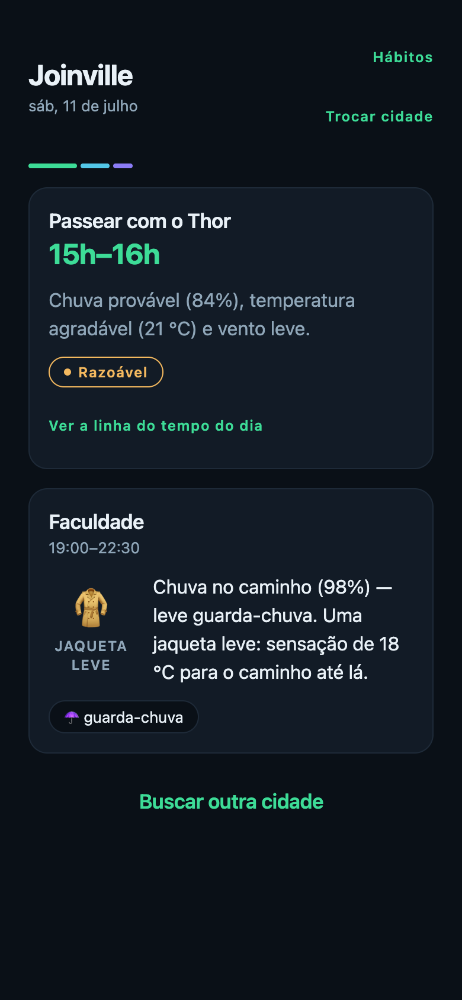
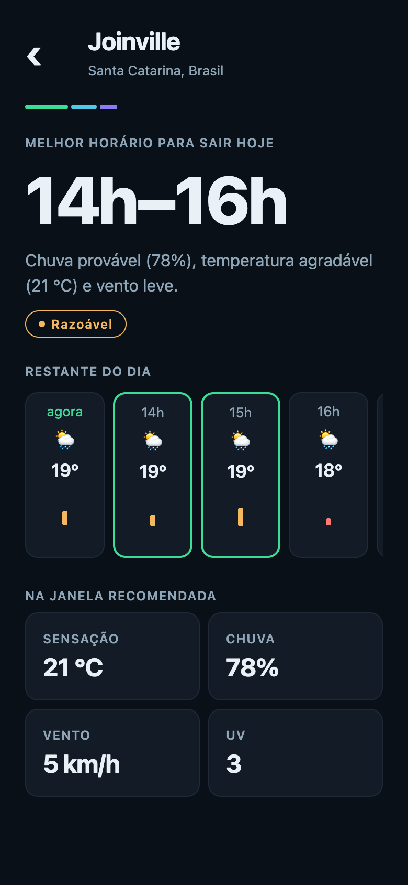

# Boreal

App **React Native (Expo)** que transforma a previsão horária da [Open-Meteo](https://open-meteo.com) em recomendações de **quando sair** e **como se vestir**, personalizadas por hábito.

O clima é insumo; a recomendação é o produto. Boreal não mostra "27 °C, nublado" e deixa a decisão com você — ele responde a pergunta que interessa:

- **Hábito de horário livre** (passear com o cachorro, caminhada) → *o melhor horário de hoje* para aquela atividade.
  > Passear com o Thor · **8h–9h** — Temperatura agradável (19 °C), baixa chance de chuva e vento leve.
- **Hábito de horário fixo** (faculdade, trabalho às 19h) → *a vestimenta adequada*, comparando ida e volta.
  > Faculdade · 18h–22h · **Vai esfriar até a volta (22 °C → 15 °C): leve uma jaqueta leve mesmo saindo no calor.** ☂️

No primeiro acesso um onboarding em etapas cadastra a cidade padrão e os hábitos; depois a home vira um painel "Hoje" com um card por hábito.

---

## Telas

| Onboarding | Painel "Hoje" | Gerenciar hábitos | Recomendação (busca avulsa) |
|---|---|---|---|
|  |  |  |  |

Tema **noite polar** (dark) e **manhã de gelo** (light), com acento verde-aurora. Ambos os modos passam por teste de contraste AA.

---

## Como rodar

Pré-requisitos: **Node LTS** (o CI roda no Node 24) e o app [Expo Go](https://expo.dev/go) no celular, ou um emulador Android/iOS.

```bash
npm install          # instalar dependências
npx expo start       # abrir o dev server (QR code para o Expo Go)
```

Atalhos: `npx expo start --android`, `--ios` ou `--web`. No terminal do Expo, `a` abre o Android, `i` o iOS e `w` o navegador.

### Qualidade

```bash
npm run lint         # ESLint (regras Expo + pureza do domain)
npm run typecheck    # tsc --noEmit (TypeScript strict)
npm test             # Jest
npm run test:cov     # Jest com relatório de cobertura
```

Os três primeiros são o gate de qualidade — nenhum PR entra em `main` com qualquer um deles vermelho.

---

## Arquitetura

Clean Architecture adaptada a React Native, com **dependências apontando sempre para dentro** (`presentation → domain ← data`). O `domain/` é TypeScript puro: nenhum import de React, RN, Expo ou libs de rede — o que o torna 100% testável sem mock de rede. Uma regra de ESLint (`no-restricted-imports`) trava essa fronteira.

```
┌───────────────────────────────────────────────────────────────┐
│  presentation/   telas, componentes burros, hooks (ViewModels) │
│                  theme, i18n (strings pt-BR centralizadas)      │
└───────────────────────────────┬───────────────────────────────┘
                                 │ usa
┌────────────────────────────────▼──────────────────────────────┐
│  domain/   entities · usecases · ports (interfaces de repo)    │
│            ── TypeScript puro, zero I/O, zero libs ──           │
│                                                                 │
│   MOTOR 1  computeComfortScore + recommendBestWindow           │
│            → melhor janela para sair                            │
│   MOTOR 2  suggestOutfit → o que vestir (ida × volta)          │
│            getTodaySuggestions → orquestra os dois no painel    │
└────────────────────────────────▲──────────────────────────────┘
                                 │ implementa
┌────────────────────────────────┴──────────────────────────────┐
│  data/   dto (JSON cru) → mappers → entities                   │
│          datasources (fetch tipado, timeout, erros) ·          │
│          repositories (Open-Meteo + AsyncStorage)              │
└───────────────────────────────────────────────────────────────┘
         di/container.ts — composition root liga tudo
```

- **Componentes não fazem fetch.** Toda I/O passa por `hook → usecase → repository → datasource`.
- **DTOs nunca vazam para a UI.** A conversão JSON → entity acontece só nos mappers.
- **Hooks são os ViewModels** (MVVM adaptado): concentram estado de tela, chamam use cases via React Query e derivam `loading / erro / vazio / sucesso`. As telas só renderizam.

### Por que estas escolhas

| Decisão | Razão |
|---|---|
| **Expo** | Setup zero-config, dev server web para verificação rápida, e o app do teste não precisa de módulo nativo custom. |
| **TanStack Query** para server state | Cache, dedupe, `retry` e `staleTime` de graça. O forecast tem `staleTime` de 5 min e chave `['forecast', cityId]`; o geocoding, 24 h. Pull-to-refresh só invalida o forecast. |
| **Zustand** para client state mínimo | Cidade selecionada, buscas recentes e o rascunho do onboarding. Sem o boilerplate do Redux — simplicidade é critério de avaliação. |
| **DI por composition root** (sem framework) | `di/container.ts` é uma fábrica que injeta `fetch` e o storage. Trocar implementações em teste é passar outro argumento — sem `jest.mock` de módulo profundo. Um framework de DI seria over-engineering aqui. |
| **AsyncStorage** com chaves versionadas (`habits:v1`, `prefs:v1`) | Persistência chave-valor é o suficiente; a versão na chave permite migração futura sem lib. |
| **Frame "fake UTC"** | O wall-clock da cidade é codificado como UTC e lido sempre via `getUTCHours`. O motor compara instantes sem depender do timezone do device — "hoje" é sempre o dia local da cidade consultada. |

---

## Os dois motores (o núcleo)

Toda a regra de negócio vive em `domain/usecases/` como funções puras e determinísticas.

### Motor 1 — Melhor horário para sair

**Passo 1: score de conforto por hora (0–100).** Cada hora parte de 100 e sofre penalidades (`computeComfortScore.ts`). Usa a **sensação térmica** (`apparent_temperature`), não a temperatura seca — é o que importa para quem vai sair.

| Fator | Penalidade |
|---|---|
| Temperatura | 0 dentro da faixa ideal (18–26 °C no perfil padrão); fora, **4 pts por °C** de desvio, teto de 50. |
| Chuva | `precipitation_probability × 0,6` (70% ≈ −42); se `precipitation > 0,5 mm`, **−25** fixos a mais. |
| Vento | ≤ 15 km/h → 0; banda linear até −15; acima, −1,5/km/h, teto de −35. |
| UV | ≤ 5 → 0; < 8 → −5; < 11 → −12; ≥ 11 → −20 (dobra em perfis de exposição prolongada). |

Score final = `clamp(100 − Σ penalidades, 0, 100)`. Classificação: **≥ 75 Ótimo · 50–74 Bom · 25–49 Razoável · < 25 Ruim**. Hora de noite (`is_day = 0`) continua na timeline, mas é inelegível para a janela.

**Exemplo numérico.** Uma hora com sensação 24 °C, 10% de chance de chuva, 12 km/h de vento, UV 4:

```
temp   0   (24 °C está dentro de 18–26)
chuva  6   (10 × 0,6)
vento  0   (12 ≤ 15)
uv     0   (4 ≤ 5)
─────────
score  100 − 6 = 94  →  Ótimo
```

**Passo 2: escolha da janela** (`recommendBestWindow.ts`). Considera só as horas **futuras** e **de dia**, procura a **janela contígua de 2–3 h com maior score médio** (janela deslizante). Empate: janela **menor** vence (mais precisa); persistindo, a **mais cedo** (quem pergunta agora quer sair logo).

Dado o dia abaixo (a partir das 16h):

```
16h → 70    17h → 92    18h → 90    19h → 68    20h → noite (inelegível)

janelas de 2h:  16–17 = 81   17–18 = 91 ★   18–19 = 79
janelas de 3h:  16–18 = 84   17–19 = 83,3
```

Vence a janela **17h–18h** (média 91). Exibida como **"17h–19h"** (fim = última hora + 1 h), selo **Ótimo**, com a frase gerada por regras: *"Temperatura agradável (23 °C), baixa chance de chuva e vento leve."*

**Guardas honestas** (nunca inventar recomendação):
- Já anoiteceu / restrições não deixam janela → `day-over` ("O dia já está acabando por aí. Amanhã tem mais!").
- Melhor média < 40 → recomenda mesmo assim, com **ressalva** do motivo dominante.
- Campos `null` da API → hora pulada; se tudo faltar → estado de erro.

### Motor 2 — O que vestir

`suggestOutfit.ts` recebe o clima na **ida** e na **volta** (quando o forecast cobre), a intensidade e se o hábito é ao ar livre. Define o nível de agasalho pela sensação térmica de partida:

| Sensação | Nível | Sugestão |
|---|---|---|
| < 10 °C | `casaco-pesado` | casaco pesado + camadas |
| 10–14 °C | `casaco` | casaco / moletom grosso |
| 15–19 °C | `camada-leve` | jaqueta leve |
| 20–25 °C | `leve` | roupa leve |
| ≥ 26 °C | `bem-leve` | roupa bem leve |

Atividade **intensa** sobe uma faixa (o corpo esquenta); **moderada** sobe só abaixo de 15 °C; **indoor** não ajusta (a dica vale para o deslocamento). Acessórios são aditivos e avaliados nas duas pontas: guarda-chuva (ou **capa**, se houver vento > 25 km/h — guarda-chuva no vento é piada pronta), corta-vento, protetor solar, boné e água.

**O diferencial é a comparação ida × volta.** Quando a sensação muda ≥ 5 °C entre início e fim, a frase destaca isso e recomenda a peça pela **volta**:

```
Faculdade, sai 18h (22 °C) e volta 22h (15 °C):
  Δ = 7 °C  →  "Vai esfriar até a volta (22 °C → 15 °C):
                leve uma jaqueta leve mesmo saindo no calor."
```

Sem o motor, você sairia de camiseta e voltaria com frio. Com ele, a dica antecipa a volta no momento em que você ainda está saindo no calor.

### Perfis por atividade

O Motor 1 é parametrizado por `ScoringProfile`, então **não há código duplicado** entre a recomendação genérica e a por hábito. Cada intensidade ajusta faixa ideal e tolerância de vento:

| Intensidade | Faixa ideal | Vento | Racional |
|---|---|---|---|
| leve (pet) | 16–26 °C | 15 km/h | exposição parada e prolongada; UV/calor pesam mais |
| moderada (caminhada) | 15–24 °C | 20 km/h | esforço médio, calor incomoda antes |
| intensa (corrida) | 10–20 °C | 25 km/h | o corpo aquece muito; frio leve é bom |

Num mesmo dia quente, a corrida é recomendada mais cedo (fresco) e o passeio mais tarde (sol fraco) — a partir do mesmo forecast.

### Orquestrador do painel

`getTodaySuggestions.ts` junta tudo: filtra hábitos ativos do dia, roda o motor certo por tipo (fixo → vestimenta; livre → janela), e usa **previsão de 2 dias** para o caso "já passou hoje" — se o horário fixo já ocorreu, mostra a sugestão de **amanhã** rotulada; se a janela livre é impossível hoje, vira `no-slot` com prévia do dia seguinte. A lista fica ordenada por horário, hoje antes de amanhã.

---

## Persistência

- `habits:v1` — array de hábitos serializado; `prefs:v1` — `{ defaultCity, onboardingDone }`.
- Leitura **defensiva em duas camadas** (guarda de shape + `validateHabit`): registro corrompido é descartado com log, nunca derruba o app.
- Nada persiste durante o onboarding até "Concluir" — exceto a cidade, que salva ao selecionar.

---

## Testes e CI

Pirâmide com o peso no domain:

- **Domain (maioria):** os dois motores com casos de borda (dia todo chuvoso, madrugada, empates, dados faltantes, cada fronteira de faixa de vestimenta, ida × volta, `no-slot`). Mappers com payloads reais da Open-Meteo como fixtures.
- **Data:** repositories com datasources e storage fakes injetados (sem mock de `fetch` global).
- **Componente (poucos e valiosos):** busca de cidade, cards do painel e o CRUD de hábitos com RNTL.

Cobertura atual: **`domain/` ~99,6%** de linhas (meta ≥ 90%; o `jest.config` trava esse threshold só no domain); ~97% no projeto todo.

O **GitHub Actions** roda em todo PR e push para `main`: `npm ci` → lint → typecheck → `test:cov`, publicando o resumo de cobertura no job summary. Sem build de binário nem deploy — fora do escopo do teste.

---

## Estrutura de pastas

```
src/
  domain/          entities · usecases (motores) · ports        (TS puro)
  data/            dto · mappers · datasources · repositories
  presentation/    screens · components · hooks · theme · i18n
  di/container.ts  composition root
app/               rotas do expo-router (arquivos finos)
```

---

## Fora de escopo (e por quê)

Deixado de fora de propósito, para manter o teste enxuto:

- **Notificações push / lembretes** — evolução natural, mas exige agendamento nativo e permissões que não agregam ao núcleo.
- **Sincronização em nuvem / contas** — não há backend; AsyncStorage cobre o caso local.
- **Integração com calendário do device** e **múltiplas cidades por hábito** — atrito sem payoff no escopo.
- **Geolocalização por GPS** — busca por nome já cumpre o requisito sem pedir permissão.
- **E2E automatizado** — a pirâmide de testes cobre o risco; o próximo passo seria [Maestro](https://maestro.mobile.dev) para os fluxos de ponta a ponta.

## Convenções

TypeScript `strict`, sem `any`. Componentes `PascalCase`, hooks `useCamelCase`, use cases com nome de verbo. Textos de UI em pt-BR centralizados em `presentation/i18n/strings.ts`. Erros tipados (`NetworkError`, `ApiError`, `NoResultsError`) mapeados para mensagens amigáveis. Acessibilidade mínima obrigatória: labels em elementos interativos, contraste AA, área de toque ≥ 48pt. Git-flow com `main` + `feature/*`, PRs e Conventional Commits.
