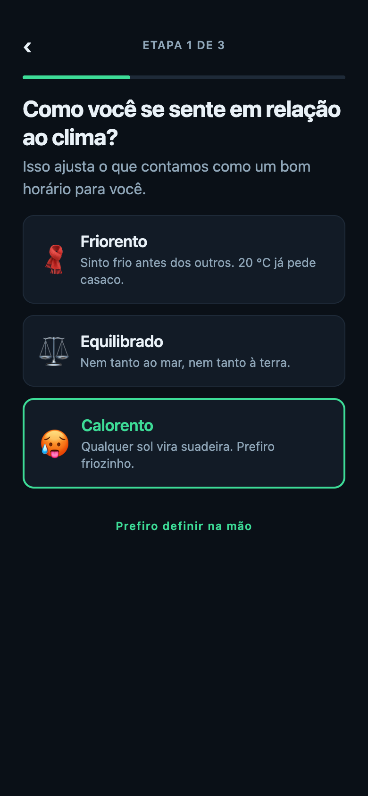
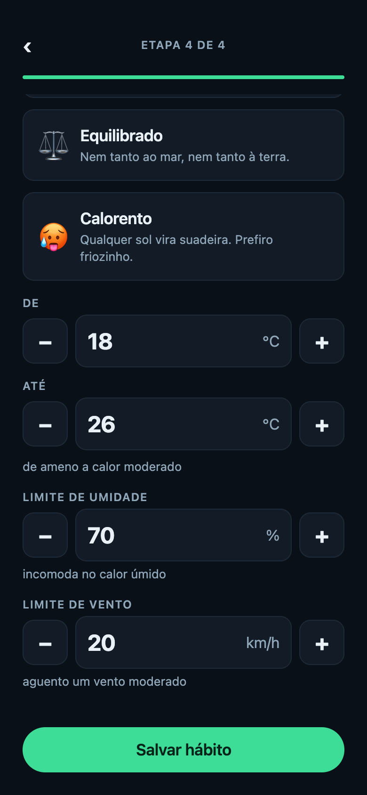
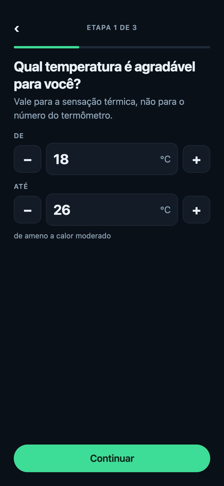
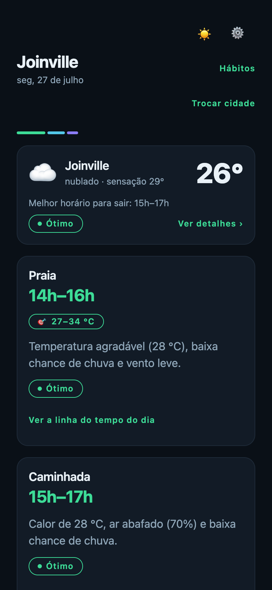

# Boreal

App **React Native (Expo)** que transforma a previsão horária da [Open-Meteo](https://open-meteo.com) em recomendações de **quando sair** e **como se vestir**, personalizadas por hábito.

O clima é insumo; a recomendação é o produto. Boreal não mostra "27 °C, nublado" e deixa a decisão com você — ele responde a pergunta que interessa:

- **Hábito de horário livre** (passear com o cachorro, caminhada) → _o melhor horário de hoje_ para aquela atividade.
  > Passear com o Thor · **8h–9h** — Temperatura agradável (19 °C), baixa chance de chuva e vento leve.
- **Hábito de horário fixo** (faculdade, trabalho às 19h) → _a vestimenta adequada_, comparando ida e volta.
  > Faculdade · 18h–22h · **Vai esfriar até a volta (22 °C → 15 °C): leve uma jaqueta leve mesmo saindo no calor.** ☂️

No primeiro acesso um onboarding em etapas cadastra a cidade padrão, o **perfil de conforto** e os hábitos; depois a home vira um painel "Hoje". Mesmo **sem nenhum hábito**, a home já abre com um **card de clima** da cidade — condição de agora e o melhor horário para sair — e um toque leva aos detalhes (próximas horas). A cidade é resolvida pela **localização do dispositivo** quando disponível, caindo na cidade padrão (ou na busca por nome) quando não é.

O que é "bom tempo" não é igual para todo mundo: o perfil diz se você é **friorento, equilibrado ou calorento** (ou define as faixas na mão), e a **rotina de sono** define até que horas faz sentido sugerir — quem topa sair às 21h recebe sugestões noturnas; quem não configura nada continua recebendo só horários com luz do dia.

Também não é igual para toda atividade: praia pede calor, treino pesado pede frio, e um banho quente não pede clima nenhum. Por isso cada hábito pode ter o **seu próprio conforto**, que sobrescreve o perfil global — quem não quiser mexer, herda.

---

## Telas

| Onboarding                                     | Painel "Hoje"                       | Recomendação e timeline                              |
| ---------------------------------------------- | ----------------------------------- | ---------------------------------------------------- |
|  |  |  |

| Perfil de conforto                                | Rotina de sono                                | Gerenciar hábitos                       |
| ------------------------------------------------- | --------------------------------------------- | --------------------------------------- |
|  |  |  |

| Conforto do hábito                                         | Faixas em números                                        | Selo de preferência própria                                         |
| ---------------------------------------------------------- | -------------------------------------------------------- | ------------------------------------------------------------------- |
|  |  |  |

Tema **noite polar** (dark) e **manhã de gelo** (light), com acento verde-aurora. Ambos os modos passam por teste de contraste AA. Um botão sol/lua discreto no topo da home alterna entre eles, sobrepondo o esquema do sistema (a escolha é persistida).

---

## Como rodar

Pré-requisitos: **Node LTS** (o CI roda no Node 24) e o app [Expo Go](https://expo.dev/go) no celular, ou um emulador Android/iOS.

```bash
npm install          # instalar dependências
npx expo start       # abrir o dev server (QR code para o Expo Go)
```

Atalhos: `npx expo start --android`, `--ios` ou `--web`. No terminal do Expo, `a` abre o Android, `i` o iOS e `w` o navegador.

### Qualidade

```bash
npm run lint         # ESLint (regras Expo + pureza do domain)
npm run typecheck    # tsc --noEmit (TypeScript strict)
npm test             # Jest
npm run test:cov     # Jest com relatório de cobertura
```

Os três primeiros são o gate de qualidade — nenhum PR entra em `main` com qualquer um deles vermelho.

---

## Arquitetura

Clean Architecture adaptada a React Native, com **dependências apontando sempre para dentro** (`presentation → domain ← data`). O `domain/` é TypeScript puro: nenhum import de React, RN, Expo ou libs de rede — o que o torna 100% testável sem mock de rede. Uma regra de ESLint (`no-restricted-imports`) trava essa fronteira.

```
┌───────────────────────────────────────────────────────────────┐
│  presentation/   telas, componentes burros, hooks (ViewModels) │
│                  theme, i18n (strings pt-BR centralizadas)      │
└───────────────────────────────┬───────────────────────────────┘
                                 │ usa
┌────────────────────────────────▼──────────────────────────────┐
│  domain/   entities · usecases · ports (interfaces de repo)    │
│            ── TypeScript puro, zero I/O, zero libs ──           │
│                                                                 │
│   MOTOR 1  computeComfortScore + recommendBestWindow           │
│            → melhor janela para sair                            │
│   MOTOR 2  suggestOutfit → o que vestir (ida × volta)          │
│            getTodaySuggestions → orquestra os dois no painel    │
└────────────────────────────────▲──────────────────────────────┘
                                 │ implementa
┌────────────────────────────────┴──────────────────────────────┐
│  data/   dto (JSON cru) → mappers → entities                   │
│          datasources (fetch tipado, timeout, erros) ·          │
│          repositories (Open-Meteo + AsyncStorage)              │
└───────────────────────────────────────────────────────────────┘
         di/container.ts — composition root liga tudo
```

- **Componentes não fazem fetch.** Toda I/O passa por `hook → usecase → repository → datasource`.
- **DTOs nunca vazam para a UI.** A conversão JSON → entity acontece só nos mappers.
- **Hooks são os ViewModels** (MVVM adaptado): concentram estado de tela, chamam use cases via React Query e derivam `loading / erro / vazio / sucesso`. As telas só renderizam.

### Por que estas escolhas

| Decisão                                                           | Razão                                                                                                                                                                                                                                                                                                                                                                                                                                                                                                                                                                          |
| ----------------------------------------------------------------- | ------------------------------------------------------------------------------------------------------------------------------------------------------------------------------------------------------------------------------------------------------------------------------------------------------------------------------------------------------------------------------------------------------------------------------------------------------------------------------------------------------------------------------------------------------------------------------ |
| **Expo**                                                          | Setup zero-config, dev server web para verificação rápida, e o app do teste não precisa de módulo nativo custom.                                                                                                                                                                                                                                                                                                                                                                                                                                                               |
| **TanStack Query** para server state                              | Cache, dedupe, `retry` e `staleTime` de graça. O forecast tem `staleTime` de 5 min e chave `['forecast', cityId]`; o geocoding, 24 h. Pull-to-refresh só invalida o forecast.                                                                                                                                                                                                                                                                                                                                                                                                  |
| **Zustand** para client state mínimo                              | Cidade selecionada, buscas recentes e o rascunho do onboarding. Sem o boilerplate do Redux — simplicidade é critério de avaliação.                                                                                                                                                                                                                                                                                                                                                                                                                                             |
| **DI por composition root** (sem framework)                       | `di/container.ts` é uma fábrica que injeta `fetch`, o storage e o cliente de localização. Trocar implementações em teste é passar outro argumento — sem `jest.mock` de módulo profundo. Um framework de DI seria over-engineering aqui.                                                                                                                                                                                                                                                                                                                                        |
| **AsyncStorage** com chaves versionadas (`habits:v1`, `prefs:v2`) | Persistência chave-valor é o suficiente; a versão na chave permitiu a migração do perfil de conforto sem lib — o formato antigo é copiado para o novo e **preservado**, então voltar uma versão do app não custa dados.                                                                                                                                                                                                                                                                                                                                                        |
| **Rotina de sono** em vez de um "modo noturno"                    | Um botão liga/desliga não responde a pergunta que o motor precisa fazer: _até que horas?_. Com acordar/dormir, a elegibilidade vira uma janela real (que cruza a meia-noite quando preciso) e a guarda de fim de dia sabe dizer quando as sugestões voltam.                                                                                                                                                                                                                                                                                                                    |
| **Entrada numérica** no lugar do slider                           | A primeira versão usava um slider de faixa dupla feito à mão. Ele saiu: a pergunta ali é _qual número_, e arrastar meio pixel para acertar 27 °C é o pior jeito de responder isso — ainda mais numa faixa que vai de −10 a 45 °C. Os campos com `−`/`+` aceitam teclado numérico, digitação parcial de negativo (`-1` a caminho de `-10` não é reescrito) e ajustam ao limite só no blur, com aviso de uma linha. Perdeu-se a leitura da faixa como barra e o ajuste contínuo; ganhou-se precisão e teste do caminho real — o arraste do slider só era verificável no preview. |
| **Campo explícito** para "não precisa de roupa"                   | Dava para deduzir (categoria `outro` + horário fixo + indoor), mas regra deduzida é regra invisível: pegaria "Meditar" sem querer e não deixaria pedir a dica de deslocamento num hábito indoor que a pessoa quer. O `skipOutfit` é perguntado no cadastro, no positivo ("Sugerir o que vestir", ligado por padrão), e a inversão para a entity acontece num ponto só.                                                                                                                                                                                                         |
| **Localização do dispositivo** (`expo-location`)                  | A home resolve a cidade pelo GPS quando disponível (o fuso vem do próprio device; sem reverse-geocode, que é native-only) e **sobrepõe** a cidade padrão. Falha/recusa/web sem suporte → cai na cidade padrão ou na busca por nome. O acesso fica atrás de um port injetável (`locationClient`), testável sem native.                                                                                                                                                                                                                                                          |
| **Frame "fake UTC"**                                              | O wall-clock da cidade é codificado como UTC e lido sempre via `getUTCHours`. O motor compara instantes sem depender do timezone do device — "hoje" é sempre o dia local da cidade consultada.                                                                                                                                                                                                                                                                                                                                                                                 |

---

## Os dois motores (o núcleo)

Toda a regra de negócio vive em `domain/usecases/` como funções puras e determinísticas.

### Motor 1 — Melhor horário para sair

**Passo 1: score de conforto por hora (0–100).** Cada hora parte de 100 e sofre penalidades (`computeComfortScore.ts`). Usa a **sensação térmica** (`apparent_temperature`), não a temperatura seca — é o que importa para quem vai sair.

| Fator       | Penalidade                                                                                                                                                                   |
| ----------- | ---------------------------------------------------------------------------------------------------------------------------------------------------------------------------- |
| Temperatura | 0 dentro da faixa ideal do perfil (18–26 °C no equilibrado); fora, **4 pts por °C** de desvio, teto de 50.                                                                   |
| Chuva       | `precipitation_probability × 0,6` (70% ≈ −42); se `precipitation > 0,5 mm`, **−25** fixos a mais.                                                                            |
| Vento       | dentro da tolerância do perfil (20 km/h no equilibrado) → 0; banda linear até −15; acima, −1,5/km/h, teto de −35.                                                            |
| Umidade     | dentro do limite do perfil (70% no equilibrado) → 0; acima, **0,8 pt por ponto de UR** excedente **quando a sensação ≥ 22 °C** (teto −25); no frio, metade disso (teto −12). |
| UV          | ≤ 5 → 0; < 8 → −5; < 11 → −12; ≥ 11 → −20 (dobra em perfis de exposição prolongada).                                                                                         |

Umidade sozinha não estraga um passeio: 85% de UR a 15 °C é só ar úmido; a 28 °C é mormaço. Por isso a penalidade é **condicionada ao calor**, e não um desconto fixo.

Score final = `clamp(100 − Σ penalidades, 0, 100)`. Classificação: **≥ 75 Ótimo · 50–74 Bom · 25–49 Razoável · < 25 Ruim**.

**Exemplo numérico.** Uma hora com sensação 24 °C, 10% de chance de chuva, 12 km/h de vento, 65% de umidade, UV 4, no perfil equilibrado:

```
temp     0   (24 °C está dentro de 18–26)
chuva    6   (10 × 0,6)
vento    0   (12 ≤ 20)
umidade  0   (65 ≤ 70)
uv       0   (4 ≤ 5)
─────────
score  100 − 6 = 94  →  Ótimo
```

**Passo 2: escolha da janela** (`recommendBestWindow.ts`). Considera só as horas **futuras e elegíveis** — com rotina de sono, as que estão dentro do ciclo acordado; sem rotina, as de dia (`is_day`) — e procura a **janela contígua de 2–3 h com maior score médio** (janela deslizante). Empate: janela **menor** vence (mais precisa); persistindo, a **mais cedo** (quem pergunta agora quer sair logo).

Dado o dia abaixo (a partir das 16h):

```
16h → 70    17h → 92    18h → 90    19h → 68    20h → noite (inelegível)

janelas de 2h:  16–17 = 81   17–18 = 91 ★   18–19 = 79
janelas de 3h:  16–18 = 84   17–19 = 83,3
```

Vence a janela **17h–18h** (média 91). Exibida como **"17h–19h"** (fim = última hora + 1 h), selo **Ótimo**, com a frase gerada por regras: _"Temperatura agradável (23 °C), baixa chance de chuva e vento leve."_

**Guardas honestas** (nunca inventar recomendação):

- Acabaram as horas elegíveis → `day-over`. Sem rotina: _"O dia já está acabando por aí. Amanhã tem mais!"_. Com rotina, o dia acaba na hora de dormir e a mensagem diz quando as sugestões voltam: _"Por hoje é isso! Amanhã a partir das 07:00: 18 °C, sem chuva."_
- Melhor média < 40 → recomenda mesmo assim, com **ressalva** do motivo dominante.
- Campos `null` da API → hora pulada; se tudo faltar → estado de erro.

### Motor 2 — O que vestir

`suggestOutfit.ts` recebe o clima na **ida** e na **volta** (quando o forecast cobre), a intensidade e se o hábito é ao ar livre. Define o nível de agasalho pela sensação térmica de partida:

| Sensação | Nível           | Sugestão                |
| -------- | --------------- | ----------------------- |
| < 10 °C  | `casaco-pesado` | casaco pesado + camadas |
| 10–14 °C | `casaco`        | casaco / moletom grosso |
| 15–19 °C | `camada-leve`   | jaqueta leve            |
| 20–25 °C | `leve`          | roupa leve              |
| ≥ 26 °C  | `bem-leve`      | roupa bem leve          |

A tabela é lida na sensação **ajustada pelo perfil**: um friorento a 18 °C reais escolhe como se fossem 15, e sai de casaco em vez de jaqueta leve — mas a frase continua mostrando a temperatura real, porque é ela que a pessoa vai conferir no termômetro. Atividade **intensa** sobe uma faixa (o corpo esquenta); **moderada** sobe só abaixo de 15 °C; **indoor** não ajusta (a dica vale para o deslocamento). Acessórios são aditivos e avaliados nas duas pontas: guarda-chuva (ou **capa**, se houver vento > 25 km/h — guarda-chuva no vento é piada pronta), corta-vento, protetor solar, boné e água.

**O diferencial é a comparação ida × volta.** Quando a sensação muda ≥ 5 °C entre início e fim, a frase destaca isso e recomenda a peça pela **volta**:

```
Faculdade, sai 18h (22 °C) e volta 22h (15 °C):
  Δ = 7 °C  →  "Vai esfriar até a volta (22 °C → 15 °C):
                leve uma jaqueta leve mesmo saindo no calor."
```

Sem o motor, você sairia de camiseta e voltaria com frio. Com ele, a dica antecipa a volta no momento em que você ainda está saindo no calor.

### Perfis por atividade

O Motor 1 é parametrizado por `ScoringProfile`, então **não há código duplicado** entre a recomendação genérica e a por hábito. A intensidade do hábito não é uma tabela fixa: ela **desloca a faixa do perfil da pessoa** (`resolveComfortProfile.ts`), então um friorento correndo continua sendo um friorento.

| Intensidade          | Faixa ideal         | Vento                             | Racional                                           |
| -------------------- | ------------------- | --------------------------------- | -------------------------------------------------- |
| leve (pet)           | piso −2 °C          | o menor entre o pessoal e 15 km/h | exposição parada e prolongada; UV/calor pesam mais |
| moderada (caminhada) | piso −3, teto −2 °C | o do perfil                       | esforço médio, calor incomoda antes                |
| intensa (corrida)    | piso −8, teto −6 °C | perfil + 5 km/h                   | o corpo aquece muito; frio leve é bom              |

Aplicados ao equilibrado (18–26 °C, 20 km/h), esses deltas reproduzem exatamente as faixas que o app usava antes das preferências: leve 16–26/15, moderada 15–24/20, intensa 10–20/25. Num mesmo dia quente, a corrida é recomendada mais cedo (fresco) e o passeio mais tarde (sol fraco) — a partir do mesmo forecast.

**Quando o hábito tem conforto próprio, o modificador de intensidade não entra.** O modificador existe para adaptar uma preferência genérica ao esforço da atividade ("corro, então tolero mais frio que a minha média"); quem escreveu à mão que praia é 27–34 °C já embutiu o contexto na escolha, e descontar mais 6 °C de "intensa" por cima distorceria uma preferência explícita.

### Orquestrador do painel

`getTodaySuggestions.ts` junta tudo: filtra hábitos ativos do dia, roda o motor certo por tipo (fixo → vestimenta; livre → janela), e usa **previsão de 2 dias** para o caso "já passou hoje" — se o horário fixo já ocorreu, mostra a sugestão de **amanhã** rotulada; se a janela livre é impossível hoje, vira `no-slot` com prévia do dia seguinte. A lista fica ordenada por horário, hoje antes de amanhã.

---

## Perfil de conforto e rotina de sono

Os motores não têm noção fixa de "bom tempo": eles recebem um perfil. `resolveComfortProfile.ts` é o ponto único que traduz a escolha da pessoa em parâmetros.

**Presets em linguagem natural** — a pessoa se reconhece na frase, não no número:

| Preset                                        | Faixa ideal | Umidade | Vento   | Vestimenta                         |
| --------------------------------------------- | ----------- | ------- | ------- | ---------------------------------- |
| 🧣 Friorento — _"20 °C já pede casaco"_       | 21–28 °C    | 75%     | 15 km/h | veste como se fizesse 3 °C a menos |
| ⚖️ Equilibrado                                | 18–26 °C    | 70%     | 20 km/h | sem ajuste                         |
| 🥵 Calorento — _"qualquer sol vira suadeira"_ | 15–23 °C    | 60%     | 25 km/h | veste como se fizesse 3 °C a mais  |

Quem prefere números define as faixas na mão em campos com `−`/`+` — temperatura, umidade e vento, um fator por etapa nas preferências globais e os três na mesma tela quando o conforto é de um hábito só (é uma pergunta a mais num fluxo curto, não um fluxo dedicado). Nesse caso o ajuste de vestimenta é **derivado** da faixa escolhida: `clamp(22 − ponto médio, −4, +4)` — uma faixa ideal de 24–30 °C indica alguém friorento, então o motor de vestimenta trata a sensação como 4 °C mais fria.

O que isso muda na prática, no mesmo dia e com o mesmo forecast: no equilibrado a janela caiu às **14h–16h**; trocando para calorento (faixa mais fria), ela migrou para **11h–13h**.

**Rotina de sono** — o app precisa saber até quando faz sentido sugerir, e isso não é o pôr do sol: é a hora de dormir. Com `{ acordar, dormir }` configurados, a elegibilidade deixa de ser `is_day` e passa a ser o **ciclo acordado**, que pode cruzar a meia-noite (`awakeWindow.ts`): para quem dorme à 01:00, às 00h30 ainda é "hoje". A timeline passa a listar as horas do ciclo, as células noturnas deixam de aparecer apagadas e a guarda de fim de dia diz quando as sugestões voltam. Quem não configura nada continua no comportamento antigo — só horários com luz do dia.

---

## Conforto por hábito

O perfil global responde "como _eu_ sou". Ele não responde "o que essa atividade pede": ninguém vai à praia procurando 20 °C, e quem treina pesado quer o contrário do que toleraria parado. Por isso o cadastro de hábito termina numa **etapa opcional de conforto** (4/4): herdar a preferência padrão vem marcado — um toque para passar — e personalizar abre os mesmos três presets e os mesmos campos numéricos de `/preferences`, sem uma segunda implementação da tela.

O que muda na prática, medido no preview com a mesma cidade, o mesmo dia e a mesma duração (2 h):

| Hábito                                 | Conforto                     | Janela              | Score   |
| -------------------------------------- | ---------------------------- | ------------------- | ------- |
| Praia                                  | próprio, 27–34 °C            | **14h–16h** (28 °C) | Ótimo   |
| Caminhada                              | herda o global (equilibrado) | **15h–17h** (28 °C) | Ótimo   |
| Praia, trocada para o preset calorento | próprio, 15–23 °C            | 15h–17h             | **Bom** |

O terceiro caso é o mais didático: a janela passa a coincidir com a da Caminhada, mas o mesmo horário vale menos para quem não gosta de calor — os 28 °C punem o calorento e não punem o equilibrado.

Um hábito com conforto próprio se identifica na lista pelo selo **🎯 27–34 °C** (ou **🎯 Calorento**, quando é preset), que aparece no painel Hoje, na revisão do onboarding e em "Meus hábitos". O selo mostra o valor em vez de só um ícone porque é ele que explica a janela diferente, e é também o atalho: um toque abre direto a etapa de conforto daquele hábito.

**Hábito que não pede clima nenhum.** "Banho quente" é fixo e indoor; passando pelo motor de vestimenta receberia _"leve um casaco: sensação de 14 °C para o caminho até lá"_ — conselho absurdo para quem vai ao chuveiro. Desligando "sugerir o que vestir" no cadastro, o card do dia vira só o lembrete (nome e horário), a etapa de conforto é pulada e nenhum motor roda para ele.

---

## Persistência

- `habits:v1` — array de hábitos serializado; `prefs:v2` — `{ defaultCity, onboardingDone, preferences }`, onde `preferences` é o perfil de conforto e a rotina de sono.
- **Migração v1 → v2 na leitura:** quem já tinha `prefs:v1` recebe o perfil equilibrado sem rotina (nada muda até configurar), o v2 é gravado e **o v1 fica intocado** — voltar uma versão do app não perde dados.
- O conforto por hábito **não** exigiu uma `habits:v2`: `comfortOverride` e `skipOutfit` são opcionais e aditivos, então o hábito gravado antes da feature continua válido e simplesmente herda o perfil global. Versionar aqui seria migração sem ganho.
- Leitura **defensiva em duas camadas** (guarda de shape + `validateHabit`/`validatePreferences`): registro corrompido é descartado com log, nunca derruba o app. O guard do perfil de conforto (`data/guards/comfortShape.ts`) é o mesmo nos dois repositórios — um `comfortOverride` malformado no JSON descarta só aquele hábito, sem levar junto os bons nem quebrar a leitura.
- Nada persiste durante o onboarding até "Concluir" — exceto a cidade, que salva ao selecionar.

---

## Testes e CI

Pirâmide com o peso no domain:

- **Domain (maioria):** os dois motores com casos de borda (dia todo chuvoso, madrugada, empates, dados faltantes, cada fronteira de faixa de vestimenta, ida × volta, `no-slot`). Também a comparação que dá nome à feature — praia com faixa própria escolhe outra janela que um hábito idêntico sem override — e a regra de que o override desliga o modificador de intensidade. Mappers com payloads reais da Open-Meteo como fixtures.
- **Data:** repositories com datasources e storage fakes injetados (sem mock de `fetch` global).
- **Componente (poucos e valiosos):** busca de cidade, cards do painel, o CRUD de hábitos e os campos numéricos com RNTL — incluindo os dois casos que motivaram a troca do slider: `-1` a caminho de `-10` não é reescrito no meio da digitação, e valor fora do limite é ajustado ao sair do campo, com aviso.

Cobertura atual: **`domain/usecases` 99,1%** de linhas e `domain/entities` 100% (meta ≥ 90%; o `jest.config` trava esse threshold só no domain); 91,6% no projeto todo — a diferença é código de UI (telas de formulário) coberto pelos fluxos, não linha a linha.

O **GitHub Actions** roda em todo PR e push para `main`: `npm ci` → lint → typecheck → `test:cov`, publicando o resumo de cobertura no job summary. Sem build de binário nem deploy — fora do escopo do teste.

---

## Estrutura de pastas

```
src/
  domain/          entities · usecases (motores) · ports        (TS puro)
  data/            dto · mappers · datasources · repositories
  presentation/    screens · components · hooks · theme · i18n
  di/container.ts  composition root
app/               rotas do expo-router (arquivos finos)
```

---

## Fora de escopo (e por quê)

Deixado de fora de propósito, para manter o teste enxuto:

- **Notificações push / lembretes** — evolução natural, mas exige agendamento nativo e permissões que não agregam ao núcleo.
- **Sincronização em nuvem / contas** — não há backend; AsyncStorage cobre o caso local.
- **Integração com calendário do device** e **múltiplas cidades por hábito** — atrito sem payoff no escopo.
- **Faixa sugerida por categoria** — o conforto por hábito é digitado do zero hoje; o passo natural é a praia já nascer com uma faixa quente e a corrida com uma fria, com o valor manual como ajuste. Ficou de fora porque exigiria calibrar números por categoria sem dados de uso para apoiar a escolha.
- **Perfis de conforto por pessoa** (a casa inteira no mesmo app) — a estrutura aceitaria vários, mas a UI para escolher entre eles não se paga aqui.
- **Aprender as preferências por feedback** ("gostei / não gostei" da sugestão) — evolução natural do perfil manual, e o caminho mais interessante para continuar este app.
- **E2E automatizado** — a pirâmide de testes cobre o risco; o próximo passo seria [Maestro](https://maestro.mobile.dev) para os fluxos de ponta a ponta.

> **Desvio consciente do escopo original:** a especificação excluía a geolocalização por GPS (para não pedir permissão num teste). A localização do dispositivo foi adicionada depois, a pedido, para abrir a home direto no clima de onde a pessoa está — sempre com fallback gracioso para a cidade padrão / busca por nome quando o GPS não está disponível. O reverse-geocode (coordenada → nome de cidade) segue de fora: é native-only e não fornece timezone.

## Convenções

TypeScript `strict`, sem `any`. Componentes `PascalCase`, hooks `useCamelCase`, use cases com nome de verbo. Textos de UI em pt-BR centralizados em `presentation/i18n/strings.ts`. Erros tipados (`NetworkError`, `ApiError`, `NoResultsError`) mapeados para mensagens amigáveis. Acessibilidade mínima obrigatória: labels em elementos interativos, contraste AA, área de toque ≥ 48pt. Git-flow com `main` + `feature/*`, PRs e Conventional Commits.
